<head>
</head>

<body>
<h1> Watch Out </h1>

Watch-Out is made to Help make Travelling Easier for women, It works on Revealing the live location of User who might feel un-secured. The App will send the Message to all of the user Friends. and The Location of the user will also be forwarded to Police which can then Help the user by checking on them.
  

  <h3> Other Features</h3>
  <li>Give position to family Members </li>
  <li>Chat</li>
  <li>Location Tracking</li>
  <li>Alert Police</li>
  <li>Real Time Location tracking  </li>
  <li>Chat with Doctor </li>
  <li>Map</li>
  <li>Alert Emergency Contact</li>
  <li>Asking Police to Track You In Real Time</li>
  <li>Safety Tips</li>
  <li>Add Updates</li>
  <li>Call Emergency Contact</li>
  <li>Chat With Friends </li>
  <li>Ask Doctor</li>
  <li>News Section - to Enlighten Yourself with Surrounding</li>
  <li> Social Media Friendly</li>
   
   To Download App 
  <a class = "Link" href="https://drive.google.com/drive/folders/11sf2gr55_PnhRbZzIUIMLCWhie1TZu7F?usp=sharing"> Link</a>
   
  
   
  
</body>

 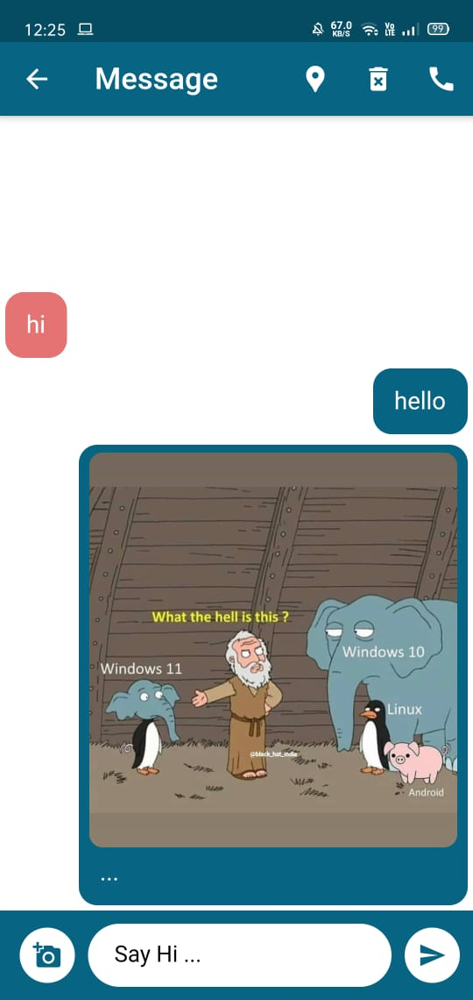  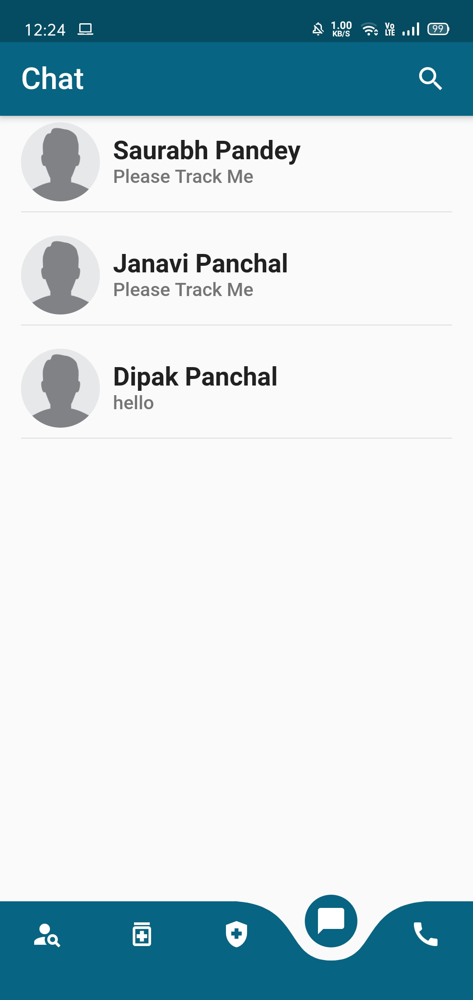 
    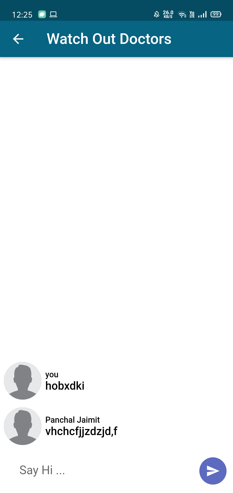 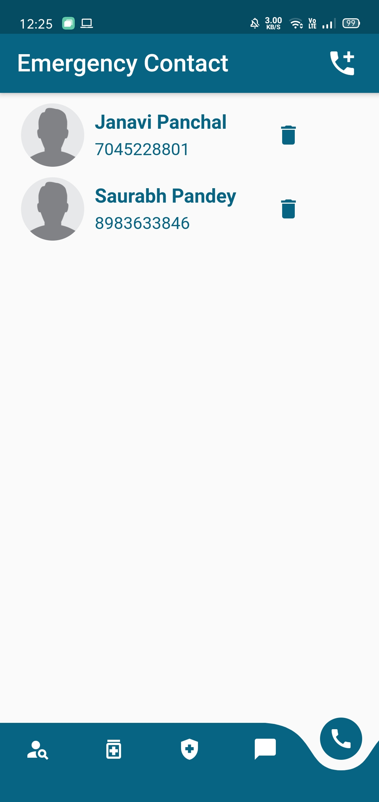 
    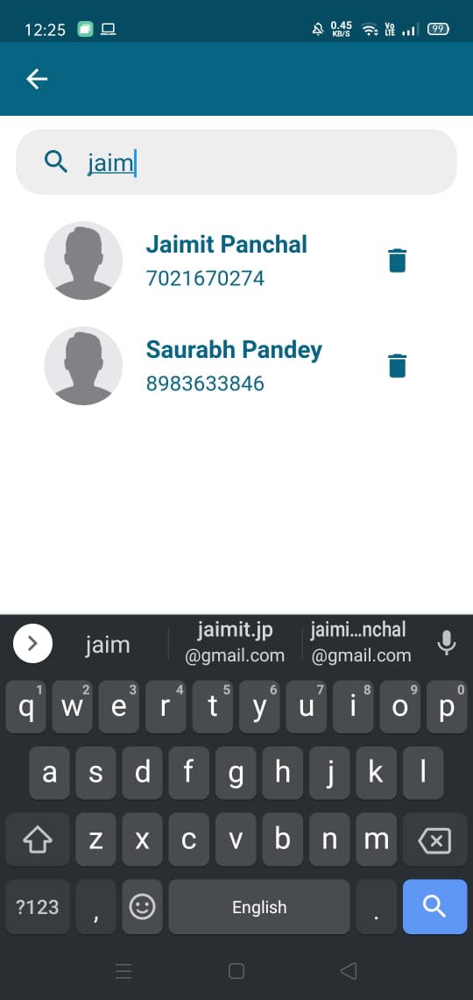 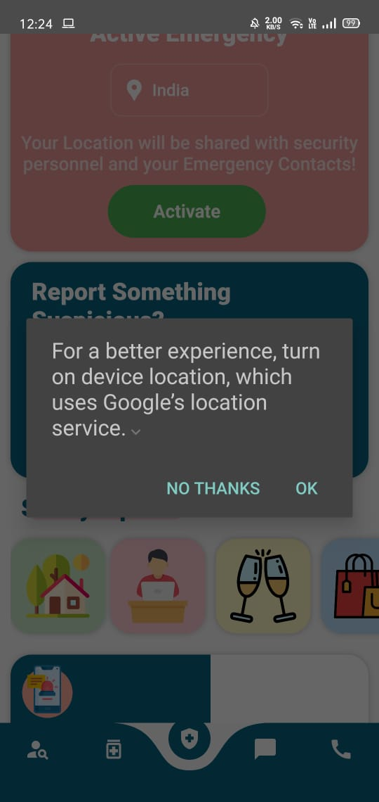 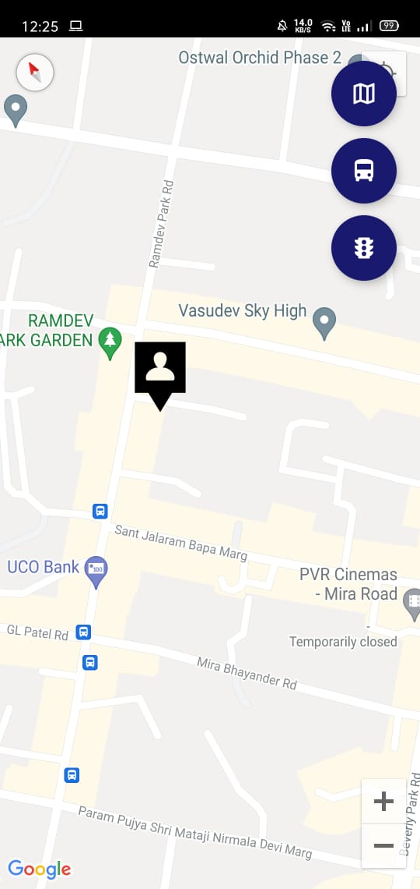   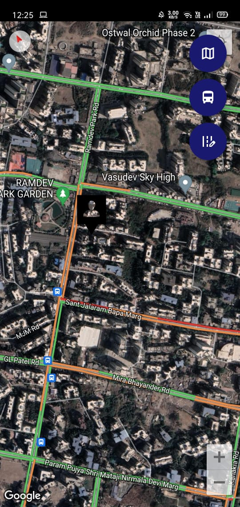 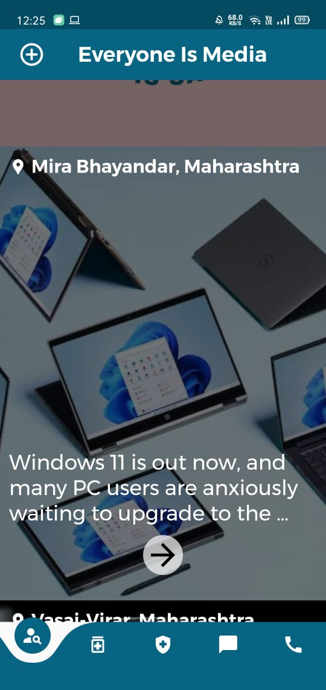 
    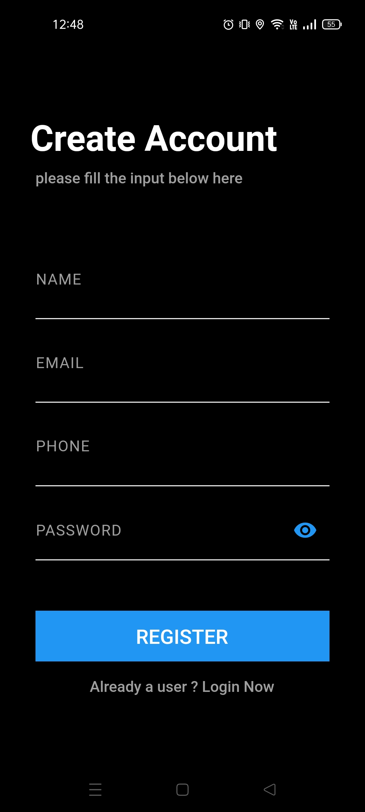 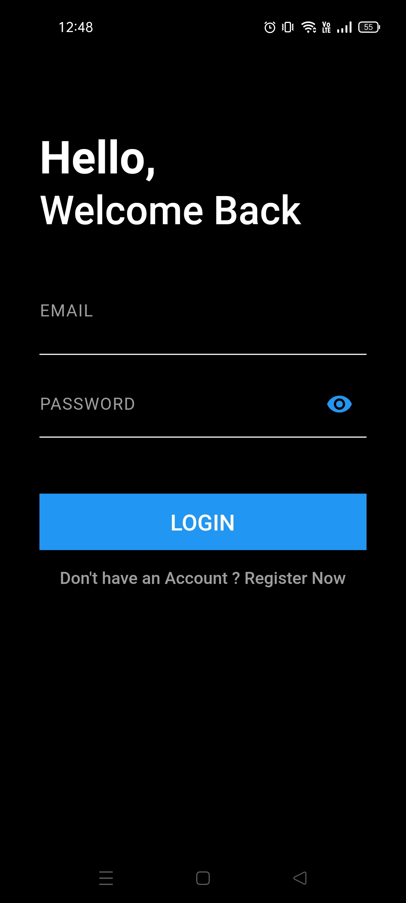 
    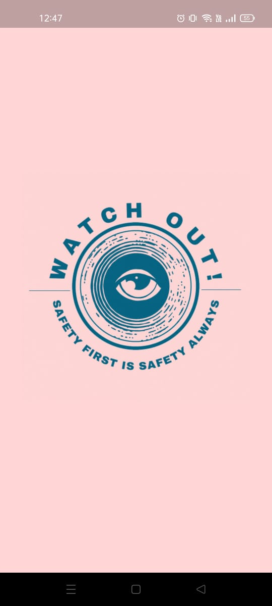  
    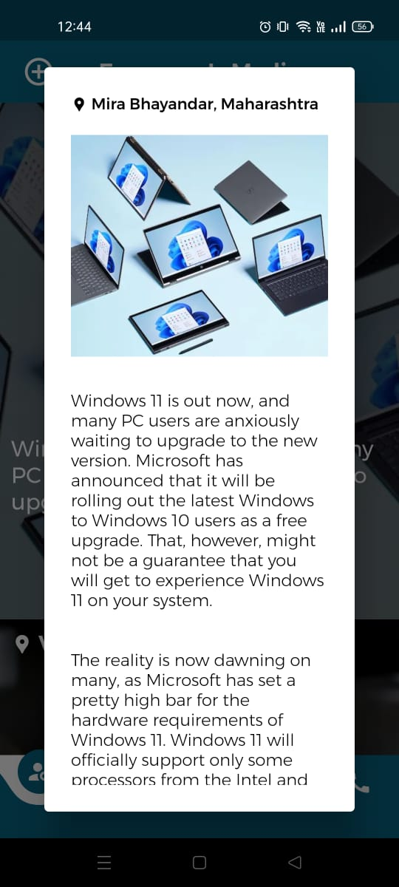
    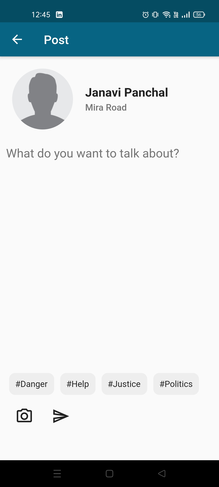 
    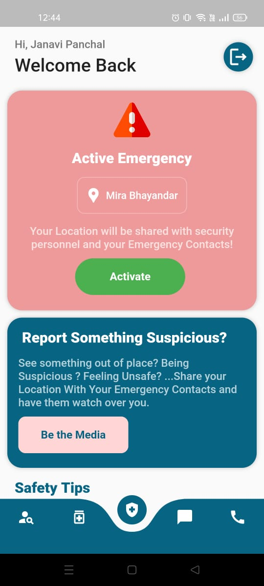 
 
